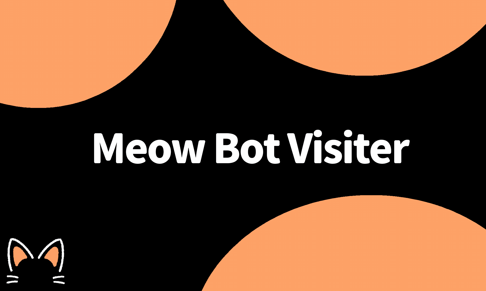

# 🐾 Meow Bot

**A feature-rich, high-performance Discord Bot built with Discord.js v14, Express & MongoDB**

<!-- Row 1: Core Technologies -->

<!-- Row 2: Top.gg & Web Services -->

<!-- Row 3: Community & Hosting -->

<!-- Row 4: Status & Legal -->

[🌐 Web Dashboard](https://meowbot.xyz) • [💬 Support Server](https://discord.gg/PaqFDgWe4J) • [➕ Invite Bot](https://discord.com/oauth2/authorize?client_id=1491052906496131296)

---

## 📌 About Meow Bot

**Meow Bot** is a modern, multipurpose Discord bot designed to empower communities with advanced server automation, security monitoring, and interactive utilities. Featuring a full-fledged ticket support desk, granular AutoMod audit logging, dynamic voice channels, in-chat Roblox script searching, and a centralized web dashboard, Meow Bot provides everything required to manage and engage a Discord server efficiently.

---

## ✨ Key Features

### 🌐 Web Dashboard Integration
* **Visual Management:** Configure server-specific preferences, manage features, and review activity logs directly on [meowbot.xyz](https://meowbot.xyz).
* **Live Synchronization:** Seamless configuration syncing directly between the bot and the database.

### 🛡️ Comprehensive AutoMod & Audit Logging
* **Message Tracking:** Logs edited and deleted messages with automatic partial caching to prevent missing metadata.
* **Voice Activity:** Real-time embeds for members joining, leaving, or switching voice channels.
* **Role & Channel Audits:** Logs newly created, updated, or deleted server roles and text/voice channels.
* **Member & Guild Changes:** Tracks member joins, leaves/kicks, nickname adjustments, and server name/icon modifications.

### 🎫 Advanced Support & AI Ticket Desk
* **Dual Ticket Engines:** Standard categorized buttons or automated keyword-responsive AI ticket workflows.
* **Custom Ticket Panels:** Build customized panels (`/ticket panel custompanel`) with up to 25 interactive buttons.
* **Staff Controls:** Claim, unclaim, priority tags, transfer tickets, close with reasons, and generate transcripts.
* **Partnership Automation:** Auto-detects partnership requests and triggers dedicated advertising sequences.

### 🔊 VoiceMaster (Join to Create)
* Automated voice room creation when members enter a designated hub.
* Auto-deletes empty temporary channels to keep server lists clean.

### 📜 ScriptBlox Search Engine
* Query Roblox scripts straight from the ScriptBlox directory with pagination.
* Displays script metadata including view counts, verified status, key requirements, and patch alerts.
* Interactive **Copy Script** modal for quick execution.

---

## 🚀 How to Add Meow Bot to Your Server

You do not need to host or install any software. Meow Bot is fully hosted and managed 24/7.

1. **Invite the Bot:** Click the [Official Invite Link](https://discord.com/oauth2/authorize?client_id=1491052906496131296).
2. **Authorize Permissions:** Select your Discord server and ensure the requested permissions (Administrator or Manage Server recommended) are granted.
3. **Web Configuration:** Visit the [Web Dashboard](https://meowbot.xyz) to manage settings visually, or use Discord commands directly.
4. **Get Help:** Join our [Support Server](https://discord.gg/PaqFDgWe4J) if you need assistance configuring your server.

---

## 📖 Command Reference

### Slash Commands
* `/ticket setup aiticket` — Launches the AI Ticket configuration manager.
* `/ticket setup quicksetup` — Guided wizard for roles, categories, and panels.
* `/ticket action close` — Closes the active support ticket.
* `/ticket panel custompanel` — Builds custom ticket panels.

### Prefix Commands (`?`)
* `?automod status` / `?automodstatus` — Displays all configured AutoMod log channels.
* `?setlog <category> #channel` — Sets an audit log destination (`message`, `voice`, `channel`, `role`, `join`, `leave`, etc.).
* `?unsetlog <category>` — Disables logging for the specified category.
* `?scriptblox <game/keyword>` — Searches for scripts on ScriptBlox.
* `?credit` — Shows developers, contributors, and bot system statistics.

---

## 👥 Contributors & Core Team

| Developer | Role | Responsibilities |
| :--- | :--- | :--- |
| **Ws ZieeLord** (`@4qg1`) | **Lead Architect** | Main Concept, QA Testing, Dashboard Foundation & UI Architecture |
| **NNK** (`@nnk_cool1`) | **System Integrator** | Core Bot Development, Dashboard Features & Database Integration |
| **p0fn** (`@p0fn`) | **Contributor** | Ideation & Core Logic |
| **Doitenroi** (`@doitenroi`) | **Contributor** | BloxGen 150 API & Bypass API Support |

### Special Thanks
* **Meow Developer Club** — Community support, testing, and troubleshooting.
* **Open Source Ecosystem** — Built on the reliable foundations of [Discord.js](https://discord.js.org/).

---

## 📄 Policies & Documentation

* [Documentation](DOCS.md) — Comprehensive guide on configuring features and commands.
* [Terms of Service](TERMS_OF_SERVICE.md) — Rules and usage conditions for Meow Bot and Dashboard.
* [Privacy Policy](PRIVACY_POLICY.md) — Information on data collection and storage.
* [Proprietary License](LICENSE) — Intellectual property rights and copyright notice.

---

Developed with ❤️ by **Ws ZieeLord & NNK**  
*Meow Bot is proprietary software. All rights reserved.*

